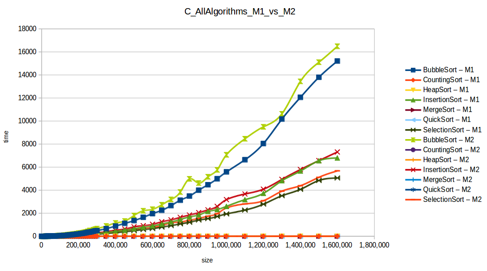

Metodos de Ordenamiento Simple
================

### 1 - Metodos de Ordenamiento Iterativo

Los metodos de ordenamiento iterativo son aquellos que se realizan de
forma que el codigo deba de repetirse una y otra vez hasta comprobar que
ha sido ordenado por completo.

#### 1.1 - Metodo de Ordenamiento de la Burbuja (BubbleSort)

El Ordenamiento de burbuja (BubbleSort) es un algoritmo de ordenamiento
simple. El mismo funciona revisando cada elemento de la lista a ordenar
con el que le sigue, cambiándolos de posición si están en un orden
incorrecto (n\>n+1). Es necesario repetir este proceso varias veces
hasta que no se necesiten más cambios, lo que significa que la lista
quedó ordenada. Un ejemplo de ordenamiento con bubblesort sería:


Su código en Python 3 sería el siguiente:

``` python
from random import sample # Importamos un metodo de la biblioteca random para generar listas aleatorias
lista = list(range(100)) # Creamos la lista base con números del 1 al 100

# Creamos una lista aleatoria con la func sample (contiene 5 elementos aleatorios de la lista base)
vectorbs = sample(lista,5) 


def bubblesort(vectorbs):
    """Esta función ordenara el vector que le pases como argumento con el metodo de Bubble Sort"""
    
    # Imprimimos la lista obtenida al principio (Desordenada)
    print("El vector a ordenar es: ",vectorbs)
    n = 0 # Establecemos un contador del largo del vector
    
    for _ in vectorbs:
        n += 1 #Contamos la cantidad de caracteres dentro del vector
    
    for i in range(n-1): 
    # Le damos un rango n para que complete el proceso. 
        for j in range(0, n-i-1): 
            # Revisa la matriz de 0 hasta n-i-1
            if vectorbs[j] > vectorbs[j+1] :
                vectorbs[j], vectorbs[j+1] = vectorbs[j+1], vectorbs[j]
            # Se intercambian si el elemento encontrado es mayor 
            # Luego pasa al siguiente
    print ("El vector ordenado es: ",vectorbs)

bubblesort(vectorbs)
```

    ## ('El vector a ordenar es: ', [35, 53, 36, 33, 90])
    ## ('El vector ordenado es: ', [33, 35, 36, 53, 90])

#### 1.2 - Metodo de Ordenamiento de Selección

El metodo de ordenamiento por selección consiste en buscar el menor
entre todos los elementos no ordenados y colocarlo al principio, luego
se debe repetir lo mismo con los restantes (no se tienen en cuenta los
ya ordenados). Aquí una muestra más visual del metodo:


Y su código en python 3 sería el siguiente:

``` python

from random import sample # Importamos un metodo de la biblioteca random para generar listas aleatorias

lista = list(range(100)) # Creamos la lista base con números del 1 al 100

# Creamos una lista aleatoria con la func sample (contiene 10 elementos aleatorios de la lista base)
vectorselect = sample(lista,10) 


def selectionsort(vectorselect):
    """Esta función ordenara el vector que le pases como argumento con el metodo Selection Sort"""
    # Imprimimos la lista obtenida al principio (Desordenada)
    print ("El vector a ordenar es: ",vectorselect)
    
    largo = 0
    
    for _ in vectorselect:
        largo += 1 # Obtenemos el largo del vector
        
    for i in range(largo): 
      
        # Encontrar el minimo elemento de los restantes sin ordenar
        minimo = i 
        for j in range(i+1, largo): 
            if vectorselect[minimo] > vectorselect[j]: 
                minimo = j 
                
        # Cambiamos el elemento minimo encontrado con el primer elemento de la matriz
        vectorselect[i], vectorselect[minimo] = vectorselect[minimo], vectorselect[i]
        # Repetimos el proceso hasta terminar
    print("El vector ordenado es: ",vectorselect)

selectionsort(vectorselect)
```

    ## ('El vector a ordenar es: ', [75, 11, 78, 20, 3, 46, 32, 88, 63, 26])
    ## ('El vector ordenado es: ', [3, 11, 20, 26, 32, 46, 63, 75, 78, 88])

#### 1.3 - Metodo de Ordenamiento de Inserción

El método de ordenamiento de inserción actua recorriendo la lista a
ordenar, tomando el elemento actual e insertándolo donde debería entre
los que ya ha recorrido. Esta es una muestra mas clara del metodo de
ordenamiento por Inserción:


Y el código en Python 3 quedaría de la siguiente forma:

``` python
from random import sample # Importamos un metodo de la biblioteca random para generar listas aleatorias

lista = list(range(100)) # Creamos la lista base con números del 1 al 100

# Creamos una lista aleatoria con la func sample (contiene 15 elementos aleatorios de la lista base)
vectorins = sample(lista,15)

def insertionsort(vectorins): 
    """Esta función ordenara el vector que le pases como argumento con el metodo Insertion Sort"""
    
    # Imprimimos la lista obtenida al principio (Desordenada)
    print("El vector a ordenar es: ", vectorins)
    
    largo = 0 # Establecemos un contador del largo
     
    for i in vectorins:
        largo += 1 # Obtenemos el largo del vector
    
    # Recorremos la lista de 1 hasta el largo del vector
    for i in range(1, largo): 
    
        elemento = vectorins[i] 
  
        # Movemos los elementos de vectorins[0...i-1], que son mayores que el elemento
        # a una posición adelante de su posición actual
        j = i-1
        while j >= 0 and elemento < vectorins[j] : 
                vectorins[j+1] = vectorins[j] 
                j -= 1
        vectorins[j+1] = elemento 
    print("El vector ordenado es: ", vectorins)

insertionsort(vectorins)
```

    ## ('El vector a ordenar es: ', [23, 98, 31, 28, 54, 86, 36, 87, 21, 67, 40, 45, 19, 94, 60])
    ## ('El vector ordenado es: ', [19, 21, 23, 28, 31, 36, 40, 45, 54, 60, 67, 86, 87, 94, 98])

## Comparación de distintos metodos de ordenamiento

La grafica demuestra como distintos tipos de ordenamiento se comportan
al variar la cantidad de elementos que contiene la lista a ordenar.
Siendo las maquinas a comparar:

M1 = Máquina 1 (1 nucleo, 1GB de RAM) M2 = Máquina 2 (2 nucleos, 2GB de
RAM)

Tenemos el siguiente grafico:


