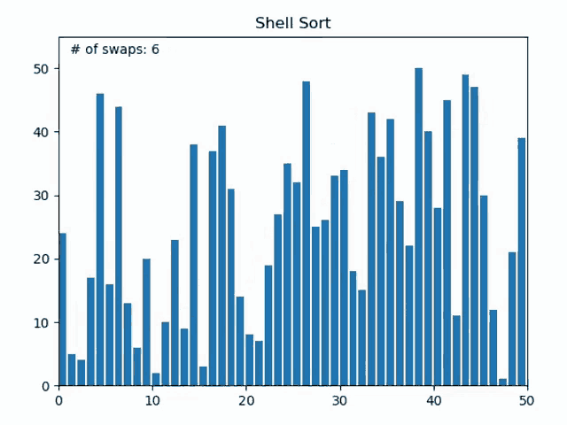
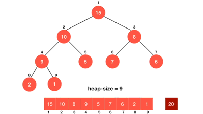
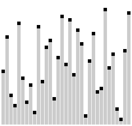
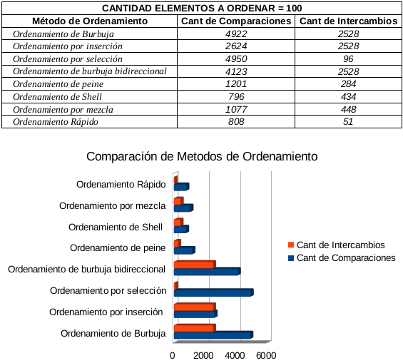

Metodos de Ordenamiento
================

Los metodos de ordenamiento son algoritmos que realizan la operación de
arreglar los registros de una tabla en algún orden secuencial de acuerdo
a un criterio de ordenamiento. El ordenamiento se efectúa con base en el
valor de algún campo en un grupo de datos. El ordenamiento puede estar
dado de forma iterativa o recursiva según la naturaleza y forma de
ejecución del mismo.

Estos son los ejemplos mas comunes de metodos de ordenamiento junto con
sus características principales y su programación en Python:

### 1 - Metodo de Ordenamiento de la Burbuja (BubbleSort)

El Ordenamiento de burbuja (BubbleSort) es un algoritmo de ordenamiento
simple. El mismo funciona revisando cada elemento de la lista a ordenar
con el que le sigue, cambiándolos de posición si están en un orden
incorrecto (n\>n+1). Es necesario repetir este proceso varias veces
hasta que no se necesiten más cambios, lo que significa que la lista
quedó ordenada. Un ejemplo de ordenamiento con bubblesort sería:


Su código en Python 3 sería el siguiente:

``` python
from random import sample 
# Importamos un metodo de la biblioteca random para generar listas aleatorias

lista = list(range(100)) # Creamos la lista base con números del 1 al 100

# Creamos una lista aleatoria con sample 
#(8 elementos aleatorios de la lista base)
vectorbs = sample(lista,8) 


def bubblesort(vectorbs):
    """Esta función ordenara el vector que le pases como argumento con el metodo de Bubble Sort"""
    
    # Imprimimos la lista obtenida al principio (Desordenada)
    print("El vector a ordenar es:",vectorbs)
    n = 0 # Establecemos un contador del largo del vector
    
    for _ in vectorbs:
        n += 1 #Contamos la cantidad de caracteres dentro del vector
    
    for i in range(n-1): 
    # Le damos un rango n para que complete el proceso. 
        for j in range(0, n-i-1): 
            # Revisa la matriz de 0 hasta n-i-1
            if vectorbs[j] > vectorbs[j+1] :
                vectorbs[j], vectorbs[j+1] = vectorbs[j+1], vectorbs[j]
            # Se intercambian si el elemento encontrado es mayor 
            # Luego pasa al siguiente
    print ("El vector ordenado es: ",vectorbs)

bubblesort(vectorbs)
```

    ## ('El vector a ordenar es:', [17, 61, 99, 59, 58, 10, 81, 47])
    ## ('El vector ordenado es: ', [10, 17, 47, 58, 59, 61, 81, 99])

### 2 - Metodo de Ordenamiento de Selección (SelectionSort)

El metodo de ordenamiento por selección consiste en buscar el menor
entre todos los elementos no ordenados y colocarlo al principio, luego
se debe repetir lo mismo con los restantes (no se tienen en cuenta los
ya ordenados). Aquí una muestra más visual del metodo:


Y su código en Python 3 sería el siguiente:

``` python

from random import sample 
# Importamos un metodo de la biblioteca random para generar listas aleatorias

lista = list(range(100)) # Creamos la lista base con números del 1 al 100

# Creamos una lista aleatoria con sample 
#(8 elementos aleatorios de la lista base)
vectorselect = sample(lista,8) 


def selectionsort(vectorselect):
    """Esta función ordenara el vector que le pases como argumento con el metodo Selection Sort"""
    # Imprimimos la lista obtenida al principio (Desordenada)
    print ("El vector a ordenar es:",vectorselect)
    
    largo = 0
    
    for _ in vectorselect:
        largo += 1 # Obtenemos el largo del vector
        
    for i in range(largo): 
      
        # Encontrar el minimo elemento de los restantes sin ordenar
        minimo = i 
        for j in range(i+1, largo): 
            if vectorselect[minimo] > vectorselect[j]: 
                minimo = j 
                
        # Cambiamos el elemento minimo encontrado con el primer elemento de la matriz
        vectorselect[i], vectorselect[minimo] = vectorselect[minimo], vectorselect[i]
        # Repetimos el proceso hasta terminar
    print("El vector ordenado es: ",vectorselect)

selectionsort(vectorselect)
```

    ## ('El vector a ordenar es:', [78, 66, 33, 73, 95, 62, 93, 11])
    ## ('El vector ordenado es: ', [11, 33, 62, 66, 73, 78, 93, 95])

### 3 - Metodo de Ordenamiento de Inserción (InsertionSort)

El método de ordenamiento de inserción actua recorriendo la lista a
ordenar, tomando el elemento actual e insertándolo donde debería
comparandoló entre los que ya ha recorrido. Esta es una muestra mas
clara del metodo de ordenamiento por Inserción:


Y el código en Python 3 quedaría de la siguiente forma:

``` python
from random import sample 
# Importamos un metodo de la biblioteca random para generar listas aleatorias

lista = list(range(100)) # Creamos la lista base con números del 1 al 100

# Creamos una lista aleatoria con sample 
#(8 elementos aleatorios de la lista base)
vectorins = sample(lista,8)

def insertionsort(vectorins): 
    """Esta función ordenara el vector que le pases como argumento con
    el metodo Insertion Sort"""
    
    # Imprimimos la lista obtenida al principio (Desordenada)
    print("El vector a ordenar es:", vectorins)
    
    largo = 0 # Establecemos un contador del largo
     
    for i in vectorins:
        largo += 1 # Obtenemos el largo del vector
    
    # Recorremos la lista de 1 hasta el largo del vector
    for i in range(1, largo): 
    
        elemento = vectorins[i] 
  
        # Movemos los elementos de vectorins[0...i-1], que son mayores que el elemento
        # a una posición adelante de su posición actual
        j = i-1
        while j >= 0 and elemento < vectorins[j] : 
                vectorins[j+1] = vectorins[j] 
                j -= 1
        vectorins[j+1] = elemento 
    print("El vector ordenado es: ", vectorins)

insertionsort(vectorins)
```

    ## ('El vector a ordenar es:', [79, 33, 81, 16, 76, 4, 28, 74])
    ## ('El vector ordenado es: ', [4, 16, 28, 33, 74, 76, 79, 81])

### 4 - Metodo de Ordenamiento Shell

El metodo de ordenamiento Shell es una mejora del metodo de Ordenamiento
por inserción ya que el metodo de inserción es eficiente si la lista
está **casi ordenada**, para ello el metodo Shell compara elementos
separados por un espacio de varias posiciones, esto permite que un
elemento haga “pasos más grandes” hacia su posición esperada, el mismo
finaliza con un Ordenamiento por inserción simple. Aquí un ejemplo más
grafico del ordenamiento Shell:



Y su codigo en Python 3 sería el siguiente:

``` python
from random import sample 
# Importamos un metodo de la biblioteca random para generar listas aleatorias

lista = list(range(100)) # Creamos la lista base con números del 1 al 100

# Creamos una lista aleatoria con sample 
#(8 elementos aleatorios de la lista base)
vectorshell = sample(lista,8)

def shellsort(vectorshell):
    
    """Esta función ordenara el vector que le pases como argumento 
    con el metodo Shell Sort"""
    
    print("El vector a ordenar con shell es:", vectorshell)
    
    largo = 0
    
    for i in vectorshell:
        largo += 1
    
    distancia = largo // 2
    
     # Creamos un bucle según las distancias
    while distancia > 0:
        # Utilizamos el Insertionsort
        for i in range(distancia, largo):
            val = vectorshell[i]
            j = i
            while j >= distancia and vectorshell[j - distancia] > val:
                vectorshell[j] = vectorshell[j - distancia]
                j -= distancia
            vectorshell[j] = val
        distancia //= 2 # Acotamos la distancia nuevamente y continua el ciclo
    print("El vector ordenado con shell es: ", vectorshell)
    
shellsort(vectorshell)
    
```

    ## ('El vector a ordenar con shell es:', [77, 40, 55, 34, 70, 72, 75, 17])
    ## ('El vector ordenado con shell es: ', [17, 34, 40, 55, 70, 72, 75, 77])

### 5 - Metodo de Ordenamiento por mezcla (MergeSort)

El metodo de ordenamiento por mezcla tiene un funcionamiento muy
particular, primero debemos saber que si la longitud de la lista es 0 ó
1 ya está ordenada, En otro caso: el algoritmo deberá dividir la lista
desordenada en dos sublistas de aproximadamente la mitad del tamaño,
luego ordenará cada sublista recursivamente aplicando el ordenamiento
por mezcla y por ultimo mezcla las dos sublistas en una sola lista
ordenada. Esta es una demostración gráfica del mismo:


Y su código en Python 3 sería el siguiente:

``` python
from random import sample 
# Importamos un metodo de la biblioteca random para generar listas aleatorias

lista = list(range(100)) # Creamos la lista base con números del 1 al 100

# Creamos una lista aleatoria con sample 
#(8 elementos aleatorios de la lista base)
vectormerge = sample(lista,8)

def mergesort(vectormerge): 
    """Esta función ordenara el vector que le pases como argumento 
    con el metodo Merge Sort"""
    
    # Imprimimos la lista obtenida al principio (Desordenada)
    print("El vector a ordenar con merge es:", vectormerge)
    
    def merge(vectormerge):
    
        def largo(vec):
                largovec = 0 # Establecemos un contador del largovec
                for _ in vec:
                    largovec += 1 # Obtenemos el largo del vector
                return largovec
        
        
        if largo(vectormerge) >1: 
            medio = largo(vectormerge)//2 # Buscamos el medio del vector
            
            # Lo dividimos en 2 partes 
            izq = vectormerge[:medio]  
            der = vectormerge[medio:]
            
            merge(izq) # Mismo procedimiento a la primer mitad
            merge(der) # Mismo procedimiento a la segunda mitad
            
            i = j = k = 0
            
            # Copiamos los datos a los vectores temporales izq[] y der[] 
            while i < largo(izq) and j < largo(der): 
                if izq[i] < der[j]: 
                    vectormerge[k] = izq[i] 
                    i+= 1
                else: 
                    vectormerge[k] = der[j] 
                    j+= 1
                k += 1
            
            # Nos fijamos si quedaron elementos en la lista
            # tanto derecha como izquierda 
            while i < largo(izq): 
                vectormerge[k] = izq[i] 
                i+= 1
                k+= 1
            
            while j < largo(der): 
                vectormerge[k] = der[j] 
                j+= 1
                k+= 1
    merge(vectormerge)
    print("El vector ordenado con merge es: ", vectormerge)
mergesort(vectormerge)
```

    ## ('El vector a ordenar con merge es:', [82, 55, 66, 5, 98, 68, 77, 94])
    ## ('El vector ordenado con merge es: ', [5, 55, 66, 68, 77, 82, 94, 98])

### 6 - Metodo de ordenamiento rápido (QuickSort)

Al igual que el ordenamiento por mezcla, el ordenamiento rápido es un
algoritmo *divide y ganarás*, el mismo funciona seleccionando un
elemento como pivot y dividiendo la matriz dada alrededor del pivot
elegido. Hay muchas versiones diferentes de ordenamiento rápido que
eligen pivotar de diferentes maneras.

1.  Elegir siempre el primer elemento como pivot.
2.  Elegir siempre el último elemento como pivot.
3.  Elegir un elemento aleatorio como pivot.
4.  Elegir la mitad como pivot.

El proceso llevado a cabo en el ordenamiento rápido es la partición, el
objetivo de las mismas es, dado una matriz A y un elemento x de la
matriz como pivot, poner x en su posición correcta en la matriz ordenada
y poner todos los elementos menores que x antes de x, y poner todos los
elementos mayores que x después de x. Aquí hay una demostración grafica
del proceso llevado a cabo:


Y su código en Python 3 sería el siguiente:

``` python
from random import sample 
# Importamos un metodo de la biblioteca random para generar listas aleatorias

lista = list(range(100)) # Creamos la lista base con números del 1 al 100

# Creamos una lista aleatoria con sample 
#(8 elementos aleatorios de la lista base)
vectorquick = sample(lista,8)
def quicksort(vectorquick, start = 0, end = len(vectorquick) - 1 ):
    """Esta función ordenara el vector que le pases como argumento 
    con el metodo Quick Sort"""
    
    # Imprimimos la lista obtenida al principio (Desordenada)
    print("El vector a ordenar con quick es:", vectorquick)
    
    def quick(vectorquick, start = 0, end = len(vectorquick) - 1):
        
        
        if start >= end:
            return

        def particion(vectorquick, start = 0, end = len(vectorquick) - 1):
            pivot = vectorquick[start]
            menor = start + 1
            mayor = end

            while True:
                # Si el valor actual es mayor que el pivot
                # está en el lugar correcto (lado derecho del pivot) y podemos 
                # movernos hacia la izquierda, al siguiente elemento.
                # También debemos asegurarnos de no haber superado el puntero bajo, ya que indica 
                # que ya hemos movido todos los elementos a su lado correcto del pivot
                while menor <= mayor and vectorquick[mayor] >= pivot:
                    mayor = mayor - 1

                # Proceso opuesto al anterior            
                while menor <= mayor and vectorquick[menor] <= pivot:
                    menor = menor + 1

                # Encontramos un valor sea mayor o menor y que este fuera del arreglo
                # ó menor es más grande que mayor, en cuyo caso salimos del ciclo
                if menor <= mayor:
                    vectorquick[menor], vectorquick[mayor] = vectorquick[mayor], vectorquick[menor]
                    # Continua el bucle
                else:
                    # Salimos del bucle
                    break

            vectorquick[start], vectorquick[mayor] = vectorquick[mayor], vectorquick[start]
            
            return mayor
        
        p = particion(vectorquick, start, end)
        quick(vectorquick, start, p-1)
        quick(vectorquick, p+1, end)
        
    quick(vectorquick)
    print("El vector ordenado con quick es:", vectorquick)

quicksort(vectorquick)
```

    ## ('El vector a ordenar con quick es:', [43, 39, 36, 86, 26, 17, 50, 56])
    ## ('El vector ordenado con quick es:', [17, 26, 36, 39, 43, 50, 56, 86])

### 7 - Metodo de ordenamiento del montón (HeapSort)

El metodo de Ordenamiento del montón es similar a la clasificación por
selección donde primero encontramos el elemento máximo y lo colocamos al
final. Repetimos el mismo proceso para el resto de elementos. Pero en el
metodo del montón debemos realizar previamente montones que son los que
irán acomodandose con el algoritmo según cual es más grande de un lado o
del otro del montón y al mismo tiempo, se irán eliminando y acomodando
los elementos mayores en la lista. Aquí hay un ejemplo gráfico del
proceso:



Y su código en Python 3 sería el siguiente:

``` python
from random import sample 
# Importamos un metodo de la biblioteca random para generar listas aleatorias

lista = list(range(100)) # Creamos la lista base con números del 1 al 100

# Creamos una lista aleatoria con sample 
#(8 elementos aleatorios de la lista base)
vectorheap = sample(lista,8)

def heapsort(vectorheap):
    """Esta función ordenara el vector que le pases como argumento 
    con el metodo Heap Sort"""
    
    # Imprimimos la lista obtenida al principio (Desordenada)
    print("El vector a ordenar con heap es:", vectorheap)

    largo = 0 # Establecemos un contador del largo
        
    for _ in vectorheap:
        largo += 1 # Obtenemos el largo del vector

    # Para amontonar la subparte a partir de i. 
    # n es el tamaño del montón.
    def amontonar(vectorheap, n, i): 
        mas_largo = i # Tomamos i como el más grande 
        izq = 2 * i + 1      
        der = 2 * i + 2    
    
        
        if izq < n and vectorheap[i] < vectorheap[izq]: 
            mas_largo = izq 
    
        # Ver si existe la subparte de i correctamente y 
        # si es mayor que i
        if der < n and vectorheap[mas_largo] < vectorheap[der]: 
            mas_largo = der 
            
    
        if mas_largo != i: 
            vectorheap[i],vectorheap[mas_largo] = vectorheap[mas_largo],vectorheap[i] 
            # Cambiar el origen, si es necesario
            # amontonar el origen. 
            amontonar(vectorheap, n, mas_largo)
            
    def heap(vectorheap):
        
        n = largo
        # Crear un montón maximo 
        for i in range(n//2 - 1, -1, -1): 
            amontonar(vectorheap, n, i) 
    
        # Extraer elementos uno a uno
        for i in range(n-1, 0, -1): 
            vectorheap[i], vectorheap[0] = vectorheap[0], vectorheap[i] 
            # Intercambio 
            amontonar(vectorheap, i, 0)
        
    heap(vectorheap)
    print("El vector ordenado con heap es:", vectorheap)

heapsort(vectorheap)
```

    ## ('El vector a ordenar con heap es:', [27, 22, 57, 3, 5, 44, 77, 80])
    ## ('El vector ordenado con heap es:', [3, 5, 22, 27, 44, 57, 77, 80])

### 8 - Metodo de Ordenamiento del peine (CombSort)

El metodo de ordenamiento del peine es una mejora del metodo de
ordenamiento de la burbuja, ya que en el metodo de la burbuja siempre se
comparan valores consecutivos, entonces todos los cambios se realizan
uno por uno. El metodo del peine (CombSort) mejora al BubbleSort usando
un espacio de tamaño superior a 1. El espacio comienza con un valor
grande y se reduce en un factor x en cada iteración hasta que alcanza el
valor 1. Por lo tanto este elimina más de una inversión con un
intercambio y funciona mejor que el metodo de la burbuja. Aquí hay una
demostración gráfica del proceso de ordenamiento:



Y su código en Python 3 sería el siguiente:

``` python
from random import sample 
# Importamos un metodo de la biblioteca random para generar listas aleatorias

lista = list(range(100)) # Creamos la lista base con números del 1 al 100

# Creamos una lista aleatoria con sample 
#(8 elementos aleatorios de la lista base)
vectorcomb = sample(lista,8)
def combsort(vectorcomb):
    """Esta función ordenara el vector que le pases como argumento
    con el metodo de Comb Sort"""
    
    # Imprimimos la lista obtenida al principio (Desordenada)
    print("El vector a ordenar con comb es:",vectorcomb)
    
    largo = 0 # Establecemos un contador del largo del vector
    
    for _ in vectorcomb:
        largo += 1
    
    
    # Comenzamos con la diferencia o distancia igual al largo del vector
    diferencia = largo
    
    # Establecemos la variable que define si es necesario o no
    #  intercambiar los numeros que se están comparando
    cambiar = True
    
    while diferencia > 1 or cambiar:
        diferencia = max(1, int(diferencia / 1.25))  
        # La diferencia minima es 1
        # En cada iteración vamos bajando la diferencia
        cambiar = False
        for i in range(largo - diferencia):
            j = i+diferencia 
            # Ubicamos el número que está a la distancia x de i
            if vectorcomb[i] > vectorcomb[j]:
                vectorcomb[i], vectorcomb[j] = vectorcomb[j], vectorcomb[i]
                # Hacemos el intercambio de los numeros
                cambiar = True
    
    print("El vector ordenado con comb es: ",vectorcomb)

combsort(vectorcomb)
```

    ## ('El vector a ordenar con comb es:', [8, 45, 72, 41, 3, 61, 31, 91])
    ## ('El vector ordenado con comb es: ', [3, 8, 31, 41, 45, 61, 72, 91])

### 9 - Metodo de Ordenamiento de la burbuja Bidireccional (CocktailSort)

El metodo de ordenamiento CocktailSort es una reforma del metodo de
ordenamiento de la burbuja, con la diferencia que en este el
ordenamiento se realiza en ambas direcciones, comprobando que el primero
sin ordenar sea el menor y el ultimo sin ordenar sea el mayor y
acomodando así en su respectivo lugar cada uno de los elementos. Aquí
hay un ejemplo gráfico del metodo de ordenamiento:


Y su código en Python 3 sería el siguiente:

``` python
from random import sample 
# Importamos un metodo de la biblioteca random para generar listas aleatorias

lista = list(range(100)) # Creamos la lista base con números del 1 al 100

# Creamos una lista aleatoria con sample 
#(8 elementos aleatorios de la lista base)
vectorcocktail = sample(lista,8)


def cocktailsort(vectorcocktail):
    """Esta función ordenara el vector que le pases como argumento
    con el metodo de Cocktail Sort"""
    
    # Imprimimos la lista obtenida al principio (Desordenada)
    print("El vector a ordenar con cocktail es:",vectorcocktail)
    
    largo = 0 # Establecemos un contador del largo
    
    for _ in vectorcocktail:
        largo += 1 # Obtenemos el largo del vector
    
    for i in range(largo//2): # Comenzamos desde la mitad aprox
        cambiar = False 
        # Declaramos la variable que inidica si es necesario intercambiar o no 
        for j in range(1+i, largo-i):
            # Probar si los dos elementos están en el orden incorrecto
            if vectorcocktail[j] < vectorcocktail[j-1]:
                # Entonces ambos elementos cambian de lugar
                vectorcocktail[j], vectorcocktail[j-1] = vectorcocktail[j-1], vectorcocktail[j]
                cambiar = True
        # Si no ocurren cambios salimos del bucle
        if not cambiar:
            break
        cambiar = False
        for j in range(largo-i-1, i, -1):
            # Probar si los dos elementos están en el orden incorrecto
            if vectorcocktail[j] < vectorcocktail[j-1]:
                # Entonces ambos elementos cambian de lugar
                vectorcocktail[j], vectorcocktail[j-1] = vectorcocktail[j-1], vectorcocktail[j]
                cambiar = True
        if not cambiar:
            break
    print("El vector ordenado con cocktail es: ",vectorcocktail)

cocktailsort(vectorcocktail)
```

    ## ('El vector a ordenar con cocktail es:', [60, 22, 41, 47, 62, 16, 43, 7])
    ## ('El vector ordenado con cocktail es: ', [7, 16, 22, 41, 43, 47, 60, 62])

## Comparación de distintos metodos de ordenamiento

### Comparación según la cantidad de tiempo de demora

La grafica demuestra cuanto tardan (en segundos) distintos tipos de
ordenamiento al variar la cantidad de elementos que contiene la lista a
ordenar. Siendo las maquinas a comparar:

M1 = Máquina 1 (1 nucleo, 1GB de RAM) M2 = Máquina 2 (2 nucleos, 2GB de
RAM)

Tenemos el siguiente grafico:


### Comparación según la cantidad de iteraciones e intercambios del algoritmo

Otra forma de comparar los algoritmos de ordenamiento es analizandolos
según la cantidad de comparaciones e intercambios que deben realizar
para cumplir su cometido, hemos analizado algunos de ellos con la
[calculadora](http://lwh.free.fr/pages/algo/tri/tri_es.htm)
correspondiente y encontrado de esta forma, los datos para realizar la
siguiente tabla y gráfico:



#### Autor

Geremias Baudino

[Linkedin](https://www.linkedin.com/in/geremiasbaudino/)

[Kaggle](https://www.kaggle.com/geremiasbaudino)

[Github](https://github.com/GBaudino)

#### Fuentes

[Analisis de Algoritmos de
Ordenamiento](https://pereiratechtalks.com/analisis-de-algoritmos-de-ordenamiento/)

[Algoritmos de Ordenamiento
GeeksforGeeks](https://www.geeksforgeeks.org/sorting-algorithms/)
